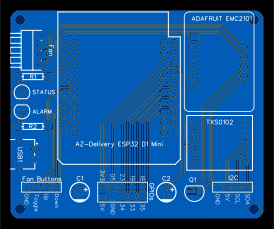
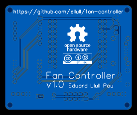
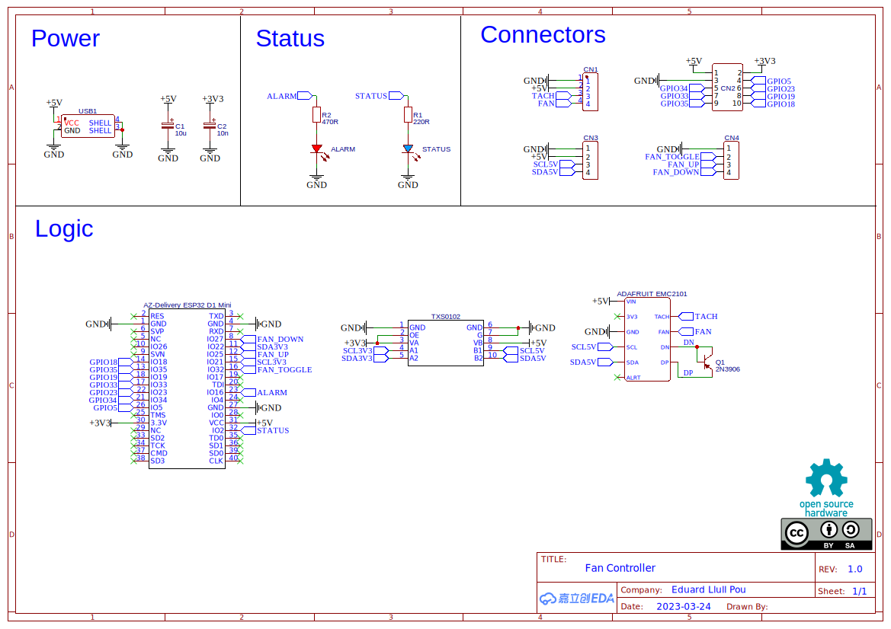
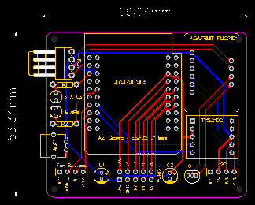

Fan Controller
==============

This is a 5V PWM fan controller built around an [ESP32](https://www.espressif.com/en/products/socs/esp32) microcontroller.

Features:
 - Integrable with [Home Assistant](https://www.home-assistant.io/).
 - Fan speed control.
 - Fan RPM sensor.
 - Temperature sensors.
 - Supports connecting other I2C devices, like a screen to display the controller information or additional sensors.
 - Physical button to toggle the fan.

Future features:
 - Physical buttons to adjust the fan speed.
 - Alarm LED.

 It also exposes 8 additional GPIO pins for future extensibility.

Build your own
--------------

- Download the [Gerber file](<hardware/Gerber_Fan Controller PCB.zip>) and order the PCB to the manufacturer of your choice. :warning: Currently (5 April 2023) I'm waiting for the PCB to arrive. Until I've tested it I cannot confirm the Gerber file doesn't have any problem.
- Download the [BOM file](hardware/BOM.tsv) and order the components.
- Assemble the board.
- Install the latest firmware. Visit the [last release page](https://github.com/ellull/fan-controller/releases/latest) to see what's changed.
  - Using the [web installer](https://llull.net/fan-controller/).
  - Download the [latest firmware](https://github.com/ellull/fan-controller/releases/latest/download/fan-controller-esp32.bin) and upload it to the ESP32 with [ESP Tool](https://github.com/espressif/esptool).
- Integrate in Home Assistant.
- Aditionally: add the device to the ESPHome dashboard.

Modify the design
-----------------

The schematics and the PCB design are available in the `hardware` directory:
- [Schematics](hardware/SCH_Fan_Controller_2023-04-04.json)  
  
- [PCB design](hardware/PCB_Fan_Controller_2023-04-04.json)  
  

I used [EasyEDA](https://easyeda.com/), which is a free of charge tool, for their design.

The ESPHome YAML file to build the firmware can be found in the `firmware` directory. It has been tested with [ESPHome](https://esphome.io/) v2023.3.2.

A bit of history
----------------

This is a hobby project aimed to build a device able to control a small fan which can easily be integrated with Home Assistant.

I build it because I wanted to hide my NAS inside a cabinet and some kind of ventilation was required to avoid overheating. I also wanted to be able to monitor temperature inside the cabinet and to change the speed of the fan. I hate noise and I also have a very fine earing: for me a 2000 RPM fan is too noisy at night. And I wanted to do it from my phone or from an automation in Home Assistant.

So, the initial design requirements were:
 - The fan speed MUST be adjustable.
 - It MUST have a temperature sensor.
 - It MUST be integrable with Home Assistant.
 - It MIGHT have a display to show the speed and the temperature.
 - It MIGHT have physical buttons.
 - It SHOULD work with an old phone charger as the power supply (I have lots I want to give them some use).

It was clear that the project would require a microcontroller and I preferred to use wifi for communications so an ESP32 (successor of the [ESP8266](https://www.espressif.com/en/products/socs/esp8266)) was a natural choice.
 
While investigating the easyest way to integrate an ESP32 in Home Assitant I found ESPHome, also from [Nabu Casa](https://www.nabucasa.com/). Using ESPHome to build the controller firmware also meant that less coding would be required.

As the fan I decided to use a [Noctua NF-A12x25 5V PWM](https://noctua.at/en/products/fan/nf-a12x25-5v-pwm) because it was quiet, its speed could be controlled with a PWM signal and it could also be powered by the same 5V power supply I was planning to use to power the microcontroller.

The last piece missing was a way to generate the PWM signal. I knew the ESP32 could generate it but while looking for different solutions I found the [Adafruit EMC2101](https://www.adafruit.com/product/4808) which also included the required temperature sensor. The Adafruit EMC2101 is an I2C fan controller and temperature sensor to which the ESP32 can off-load the PWM signal generation and a tachometer as a bonus. But it was not supported by ESPHome :disappointed:. At this point I needed to decide between:
 - Develop all the firmware code from scratch.
 - Add support for the Adafruit EMC2101 to ESPHome.

I decided that the latter was much less work, I could contribute to a wonderful project and some other people could benefit of my work. Also I found [this feature request](https://github.com/esphome/feature-requests/issues/1679) to add support for the Adafruit EMC2101 to ESPHome.

Because the Adafruit EMC2101 worked at 5V and the ESP32 at 3.3V, a 2-bit bidirectional voltage-level shifter fast enough for the I2C bus would be required and I decided to use a module with a [Texas Instruments TXS0102](https://www.ti.com/product/TXS0102).

I assembled all the components in a breadboard and started coding an [ESPHome external component](https://esphome.io/components/external_components.html) to add support for the Adafruit EMC2101. When I got it all working, the breadboard was replaced by a perfboard and the whole contraption was mounted on the cabinet.

With the external component working fine for a few months, on May 29, 2022 I created [a draft pull request](https://github.com/esphome/esphome/pull/3517). But life is unpredictable and I needed to pause the whole project: I could not even send the PR for review. On 24 Feb 2023 the github-actions bot closed it, and, just a couple days later I was able to work again on the project and created [a new pull request](https://github.com/esphome/esphome/pull/4491).

I also designed a PCB to replace the perfboard and decided to publish the PCB schematics, PCB design, [BOM](https://en.wikipedia.org/wiki/Bill_of_materials) and firmware as [Open Source Hardware](https://www.oshwa.org/definition/) in this repository. You can find them in the `hardware` and `firmware` directories.

All the files are released under a [Creative Commons Attribution ShareAlike 4.0](https://creativecommons.org/licenses/by-sa/4.0/) license.

It've been a very fun project :satisfied:.
